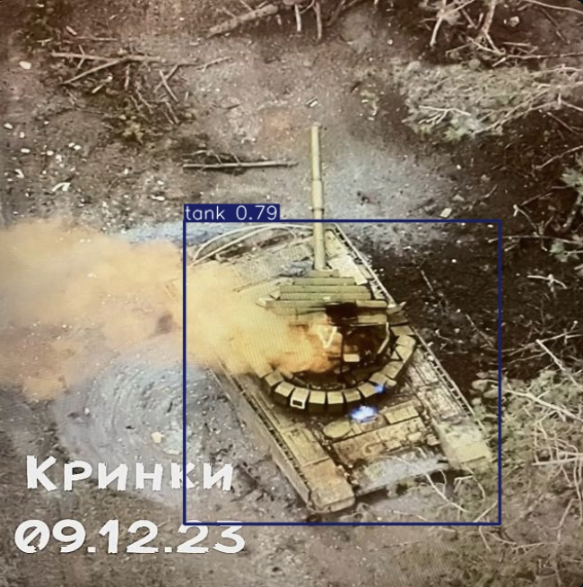
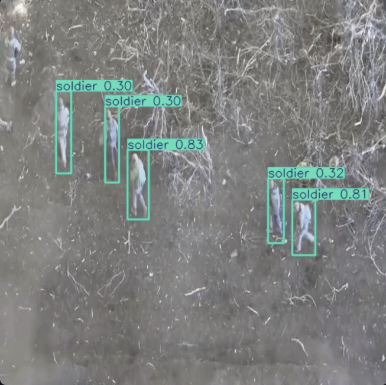

# Aerial Military Vehicle Detector

YOLOv8 fine-tuned for detecting military vehicles in drone reconnaissance and satellite imagery. Trained on a public OSINT dataset of imagery from the Russo-Ukrainian war.

🔗 **Live demo: https://aerial-vehicle-detector.streamlit.app**

## What it does

Detects 5 classes in aerial / overhead imagery:
- Tank
- Armoured Personnel Carrier (APC)
- Air-fighter
- Bomber
- Soldier

## Sample detections




## How it works

- **Architecture**: YOLOv8n (nano variant) fine-tuned via the Ultralytics framework
- **Training data**: ~5,000 labelled instances across 5 classes from the [Military Vehicle Recognition dataset](https://universe.roboflow.com/militaryvehiclerecognition/military-vehicle-recognition) on Roboflow Universe (CC BY 4.0)
- **Training**: 50 epochs, batch size 16, image size 640px, on a single T4 GPU (Google Colab)
- **Deployment**: Streamlit Community Cloud

## Performance

| Metric | Value |
|---|-------|
| mAP@0.5 | 0.511 |
| mAP@0.5:0.95 | 0.299 |
| Precision | 0.631 |
| Recall | 0.469 |


## Limitations

- Trained on a small (~5,000 instance) public dataset
- Class imbalance: bomber class has only 285 training instances; expect lower performance on this class
- Mixed perspectives in training data (drone footage + satellite + ground-level) means the model is general-purpose rather than specialised
- Performance degrades on imagery with different sensors, weather, geographies, or angles than training distribution
- Not validated for operational use; built as a portfolio project

## Reproduce

```bash
git clone https://github.com/Vioxacute/satellite-vehicle-detector.git
cd satellite-vehicle-detector
python -m venv .venv
source .venv/bin/activate  # Windows: .venv\Scripts\activate
pip install -r requirements.txt
streamlit run app/streamlit_app.py
```

To retrain, see `src/train.py` and the Colab notebook in `notebooks/` (run end-to-end in ~30 mins on free T4).

## Tech stack

Python · PyTorch · Ultralytics YOLOv8 · Streamlit · OpenCV · Roboflow

## Credits

Dataset: [Military Vehicle Recognition](https://universe.roboflow.com/militaryvehiclerecognition/military-vehicle-recognition) by MilitaryVehicleRecognition workspace, Roboflow Universe, licensed CC BY 4.0.